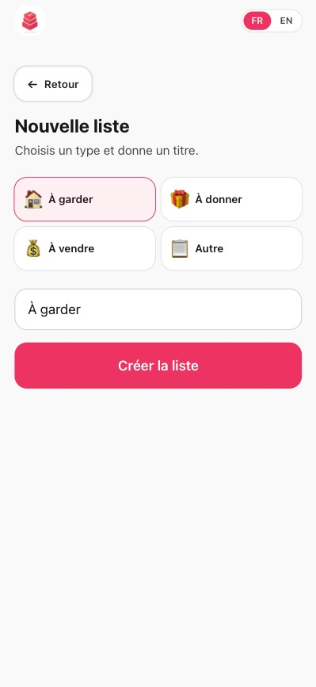
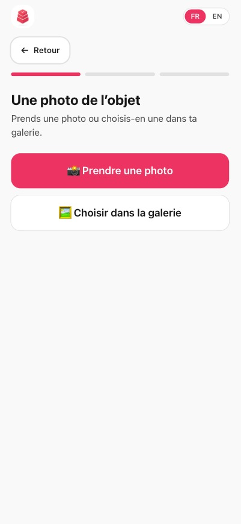
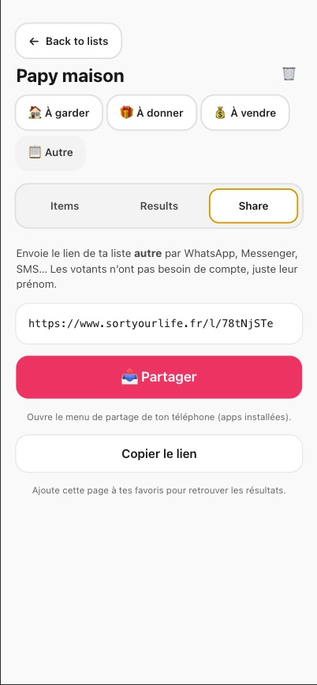
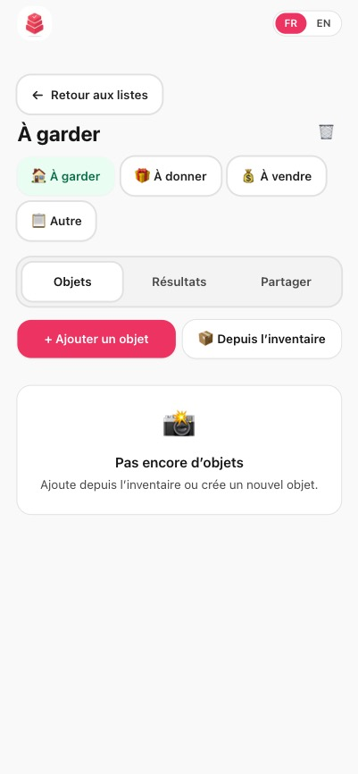
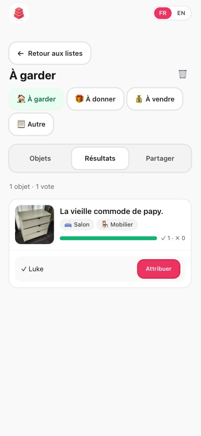
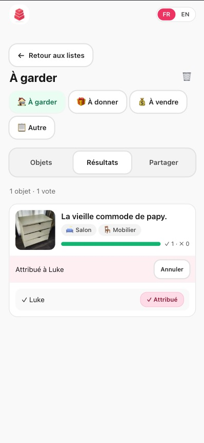
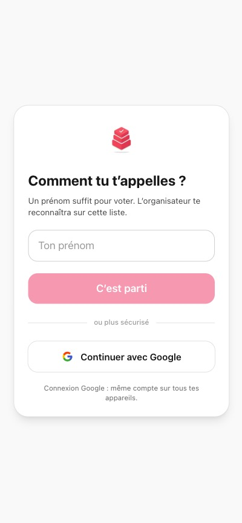
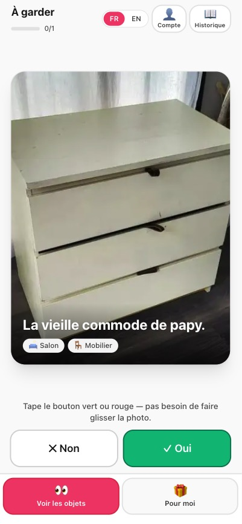
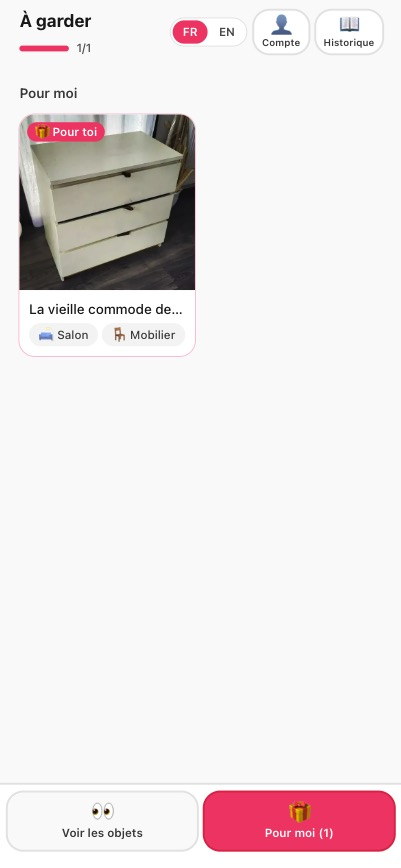

# Sort your life

<p align="center">
  <a href="https://sortyourlife.fr/">
    
  </a>
</p>

<p align="center">
  <strong>En ligne : <a href="https://sortyourlife.fr/">sortyourlife.fr</a></strong>
</p>

<p align="center">
  <a href="./README.md">🇬🇧 English</a> · 🇫🇷 Français
</p>

**Sort your life** aide les familles à se répartir les objets d’un débarras, d’un déménagement ou d’une succession.
Tu photographies ce que tu proposes, tu partages un lien, et chacun dit oui ou non en swipant — comme sur Tinder.
Toi, tu vois qui est intéressé et tu attribues chaque chose à la bonne personne.

---

## Description du produit

### Le problème

Quand on vide un appartement ou qu’on trie des affaires à donner ou à vendre, la coordination passe souvent par des groupes WhatsApp interminables : photos floues, messages « moi je le veux », oublis, doublons. Personne n’a une vue claire de qui veut quoi.

### La solution

Sort your life centralise tout autour de **listes partageables** et d’un **inventaire photo** personnel :

1. **Photographier** les objets (caméra ou galerie), les classer par pièce, type et tags perso.
2. **Répartir** dans des listes selon l’intention : à garder, à donner, à vendre, ou autre.
3. **Partager** le lien public d’une liste (`/l/[slug]`).
4. La famille **swipe** oui / non sur chaque objet, sans créer de compte.
5. L’organisateur consulte les **résultats** et **attribue** (match) chaque objet à une personne qui a dit oui.

### Deux expériences, deux identités

| Rôle | Connexion | Où |
|------|-----------|-----|
| **Organisateur** | Compte Google ou Apple (Auth.js) | `/dashboard/*` — listes, inventaire, résultats, partage |
| **Votant** | Prénom seulement (+ identifiant anonyme en local) | `/l/[slug]` — swipe, historique, matchs reçus |

Un même utilisateur peut organiser ses listes avec son compte et voter sur le lien d’un autre avec le flux « votant », sans mélanger les deux.

### Parcours organisateur (détaillé)

**Inventaire** (`/dashboard/inventory`)

- Wizard en 3 étapes : photo → pièce (emojis) → type + tags optionnels + nom.
- Grille de vignettes, filtres par pièce / type / tag, sélection multiple.
- Assignation vers une liste existante ou création d’une nouvelle campagne.
- Édition en bottom sheet, pièces personnalisées (« Mes pièces »).

**Listes** (`/dashboard/lists`)

- Types suggérés : à garder, à donner, à vendre, liste perso.
- Détail d’une liste : onglets **Objets**, **Résultats**, **Partager**.
- Ajout d’objets depuis l’inventaire ou création directe sur la liste.
- Partage natif (WhatsApp, SMS, mail…) via l’API Web Share quand disponible.
- Visite guidée (Driver.js) à la première liste, avec enchaînement optionnel vers l’ajout du premier objet.

**Résultats & attribution**

- Pour chaque objet : liste des personnes qui ont voté **Oui** ou **Non**.
- Bouton **Attribuer** (match) : un seul receveur par objet, choisi parmi les Oui.
- Déplacer un objet vers une autre liste ou le retirer (retour inventaire) supprime votes et matchs sur cette liste.

### Parcours votant (détaillé)

**Entrée** (`/l/[slug]`)

- Saisie du prénom ou « Continuer avec Google » (optionnel, pour lier les votes au compte).
- Identité stockée localement (`visitorId`) pour retrouver son historique.

**Swipe**

- Cartes plein écran, une photo à la fois.
- Gestes ou boutons **Oui** / **Non**, barre de progression.
- Un vote par objet, modifiable ensuite.

**Historique** (icône livre)

- Tous ses votes sur la liste, modification en un tap ou effacement global.

**Matchs** (onglet)

- Objets que l’organisateur lui a attribués (« C’est pour toi »).

### Glossaire

| Terme | Signification |
|-------|----------------|
| **Vote** | Choix du votant : oui ou non sur un objet. |
| **Swipe** | Mode découverte objet par objet. |
| **Match** | Décision de l’organisateur : « cet objet est pour cette personne » (pas un like mutuel). |
| **Inventaire** | Bibliothèque perso de tous tes objets photographiés. |
| **Liste** | Campagne partageable (slug, votes, matchs) — un objet n’est que dans **une** liste à la fois. |
| **Tag perso** | Libellé réutilisable (ex. « bureau Florian », « cave »). |

### Règles métier

- **1 vote** par objet et par votant (modifiable).
- **1 match** par objet, réservé à un votant qui a dit **Oui**.
- Si un votant repasse en **Non**, son match sur cet objet est annulé.
- Déplacer ou retirer un objet d’une liste **efface** votes et matchs pour cette liste.
- Objet sans liste : en inventaire (`listId` null) jusqu’à assignation.
- Images : redimensionnement Sharp (512 px), JPEG ≤ 500 Ko ; Vercel Blob en prod, `public/uploads/` en dev local.

### Fonctionnalités transverses

- **Mobile-first** : navigation basse, zones tactiles larges, safe areas.
- **i18n** : français par défaut, anglais via sélecteur (next-intl).
- **PWA** : installable sur l’écran d’accueil (Serwist), invite sur le dashboard mobile.
- **Admin** (`/admin`, emails autorisés) : statistiques d’usage et graphiques.

### Hors périmètre actuel

- Un objet dans plusieurs listes simultanément.
- Paiement, enchères, messagerie intégrée.
- Notifications push « tu es matché ».
- Scan code-barres, reconnaissance IA d’objets.

---

## Captures d’écran

### Côté organisateur — construire et partager une liste

<p align="center">
  
  
  
</p>
<p align="center"><sub>1. Créer une liste · 2. Ajouter le premier objet · 3. Partager le lien</sub></p>

<p align="center">
  
  
  
</p>
<p align="center"><sub>4. Tes listes · 5. Les résultats · 6. Attribuer chaque objet à la bonne personne</sub></p>

### Côté votant — dire oui ou non

<p align="center">
  
  
  
</p>
<p align="center"><sub>1. Saisir son prénom · 2. Swipe oui ou non · 3. Voir ses matchs</sub></p>

> Images haute résolution dans [`public/promo/creators/`](./public/promo/creators/) et [`public/promo/voters/`](./public/promo/voters/).

---

## Stack

| Couche | Techno |
|--------|--------|
| Framework | Next.js 15 (App Router) + TypeScript |
| UI | Tailwind CSS, Framer Motion, Driver.js (onboarding) |
| i18n | next-intl (FR / EN) |
| Base | Prisma + **PostgreSQL** |
| Auth organisateur | Auth.js v5 — Google, Apple |
| Images | Sharp · Vercel Blob (prod) · `public/uploads/` (dev) |
| PWA | Serwist |

---

## Démarrer en local

### Prérequis

- Node.js 20+
- PostgreSQL (Docker, Neon, Supabase ou Postgres.app)

### Installation

```bash
git clone https://github.com/O-Plums/share-items.git
cd share-items
npm install
cp .env.example .env
# Édite .env : DATABASE_URL, AUTH_SECRET, AUTH_GOOGLE_* (voir ci-dessous)
npx prisma migrate dev
npm run dev
```

L’app tourne sur **http://localhost:8080**.

Sans `BLOB_READ_WRITE_TOKEN`, les photos sont enregistrées dans `public/uploads/` (ignoré par git).

---

## Routes principales

### Organisateur (connecté)

| Route | Rôle |
|-------|------|
| `/login` | Connexion Google / Apple |
| `/dashboard/lists` | Listes — créer une campagne |
| `/dashboard/[listId]` | Détail : Objets · Résultats · Partager |
| `/dashboard/inventory` | Inventaire perso |
| `/dashboard/inventory/new` | Nouvel objet (wizard photo) |
| `/dashboard/[listId]/items/new` | Ajouter un objet à une liste |

### Votant (lien public)

| Route | Rôle |
|-------|------|
| `/l/[slug]` | Swipe, historique, matchs, compte votant |

### Autres

| Route | Rôle |
|-------|------|
| `/` | Landing |
| `/admin` | Stats (emails `ADMIN_EMAILS`) |
| `/legal/cgu` · `/legal/cgv` | CGU · CGV |

---

## Variables d’environnement

Copie [`.env.example`](./.env.example) vers `.env` — **ne commite jamais** `.env`.

| Variable | Obligatoire | Usage |
|----------|-------------|-------|
| `DATABASE_URL` | Oui | PostgreSQL |
| `AUTH_SECRET` | Oui | Session Auth.js (`openssl rand -base64 32`) |
| `AUTH_GOOGLE_ID` / `AUTH_GOOGLE_SECRET` | Recommandé | Login organisateur + option votant |
| `AUTH_APPLE_ID` / `AUTH_APPLE_SECRET` | Optionnel | Sign in with Apple |
| `BLOB_READ_WRITE_TOKEN` | Prod Vercel | Upload images (Blob) |
| `AUTH_URL` | Optionnel | URL publique si domaine custom |
| `ADMIN_EMAILS` | Optionnel | Accès `/admin` (virgules) |
| `NEXT_PUBLIC_APP_NAME` | Optionnel | Nom affiché du produit (défaut « Sort your life ») |
| `NEXT_PUBLIC_APP_SHORT_NAME` | Optionnel | Nom court PWA (défaut « Sort ») |
| `NEXT_PUBLIC_SITE_URL` | Recommandé | URL publique pour OG / sitemap (défaut `https://sortyourlife.fr`) |
| `NEXT_PUBLIC_GOOGLE_SITE_VERIFICATION` | Optionnel | Token Google Search Console |
| `NEXT_PUBLIC_LEGAL_OWNER_NAME` | Optionnel | Nom de l'éditeur sur les pages légales |
| `NEXT_PUBLIC_LEGAL_EMAIL` | Optionnel | Email de contact sur les pages légales |
| `NEXT_PUBLIC_GITHUB_URL` | Optionnel | Override le lien « Code source » dans le footer |

### SEO

- `robots.txt` généré sur `/robots.txt` (autorise `/`, bloque `/dashboard`, `/admin`, `/api`, `/l/`, `/login`).
- `sitemap.xml` sur `/sitemap.xml`.
- Open Graph + Twitter Card + JSON-LD (WebSite, Organization, SoftwareApplication) sur la home.
- Lier la propriété sur **Google Search Console**, mettre le token dans `NEXT_PUBLIC_GOOGLE_SITE_VERIFICATION` et soumettre le sitemap.

Redirect OAuth : `{ORIGIN}/api/auth/callback/google` (et `/apple`).

---

## Déploiement Vercel

Guide détaillé : **[DEPLOY.md](./DEPLOY.md)**

1. Base **PostgreSQL** + variables sur le projet Vercel.
2. **Blob** connecté (`BLOB_READ_WRITE_TOKEN`).
3. Import du repo — build avec `prisma migrate deploy` (`vercel.json` / `scripts/vercel-build.sh`).

---

## Scripts npm

| Commande | Action |
|----------|--------|
| `npm run dev` | Dev sur le port **8080** |
| `npm run dev:pwa` | Dev + rebuild service worker |
| `npm run build` | Prisma + migrate deploy + build Next + Serwist |
| `npm start` | Serveur production |
| `npm run db:migrate` | Migration Prisma en dev |
| `npm run db:studio` | Prisma Studio |
| `npm test` | Tests unitaires (Vitest) |
| `npm run test:watch` | Tests unitaires en watch |

---

## Tests

Tests unitaires sur les helpers purs de `src/lib` et `src/i18n` (admin allowlist, slugs, taxonomies, kinds de listes, tour state, SEO, i18n, attribution, légal…).

```bash
npm test           # run une fois
npm run test:watch # mode watch
```

Stack : Vitest + happy-dom. Les tests vivent dans `tests/unit/*.test.ts` et utilisent l'alias `@/*` (résolu via `tsconfigPaths`).

---

## Légal

Pages publiques : `/legal/cgu` et `/legal/cgv`.

Le wording vit dans des fichiers i18n dédiés `messages/legal/{fr,en}.json` (fusionnés sous le namespace `legal` au runtime). Identité de l'éditeur via env vars :

```bash
NEXT_PUBLIC_LEGAL_OWNER_NAME="Prénom Nom"
NEXT_PUBLIC_LEGAL_EMAIL="contact@sortyourlife.fr"
```

À défaut, les pages affichent `[À compléter]`. Pas d'adresse postale au stade bêta.

> **À venir avant ouverture publique (RGPD + LCEN)** : mentions légales détaillées + politique de confidentialité.

---

## Acquisition & tracking

URLs UTM prêtes à copier (Meta, Google, TikTok, Reddit…) + lecture du funnel admin et des sources : **[ACQUISITION.md](./ACQUISITION.md)**.

5 events trackés via Vercel Analytics : `signup`, `list_created`, `invite_sent`, `vote_cast`, `match_reached`.
Dashboard funnel + top sources : `/admin`.

---

## Structure du projet

```
public/
  promo/
    creators/             # Captures du parcours organisateur (README + landing)
    voters/               # Captures du parcours votant
messages/                 # fr.json, en.json (next-intl)
  legal/                  # Wording légal (i18n séparé)
src/
  app/
    api/                  # auth, lists, inventory, votes, matches, upload, admin, attribution
    dashboard/            # Espace organisateur
    l/[slug]/             # Expérience votant
    admin/
    legal/                # /legal/cgu, /legal/cgv
    login/
  components/
    ItemWizard.tsx
    onboarding/           # FirstListTour, ItemWizardTour
    IdentityGate.tsx
    AttributionCapture.tsx
    PostSignupSync.tsx
  i18n/
  lib/
prisma/
  schema.prisma
  migrations/
DEPLOY.md
ACQUISITION.md
```

---

## Licence

[MIT](./LICENSE) — fais ce que tu veux avec le code : utilise-le, modifie-le, fork-le, déploie-le, vends-le. Aucune garantie, aucune restriction.

Deux choses que la MIT **ne couvre pas** :

- Le **nom « Sort your life » et le logo** (`public/logo.png`, couleurs de marque, copies marketing dans `messages/*.json`). Ils restent l'identité du projet — si tu forks pour construire autre chose, change le nom.
- Les photos utilisées dans la démo et le matériel promo (`public/promo/**/*.jpg`, `public/uploads/`) — elles peuvent appartenir à des tiers.

En cas de doute, ouvre une issue ou écris à contact@sortyourlife.fr.
