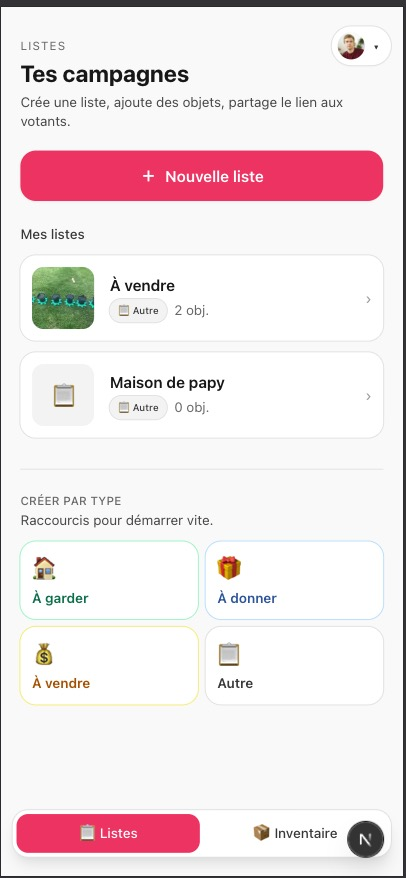
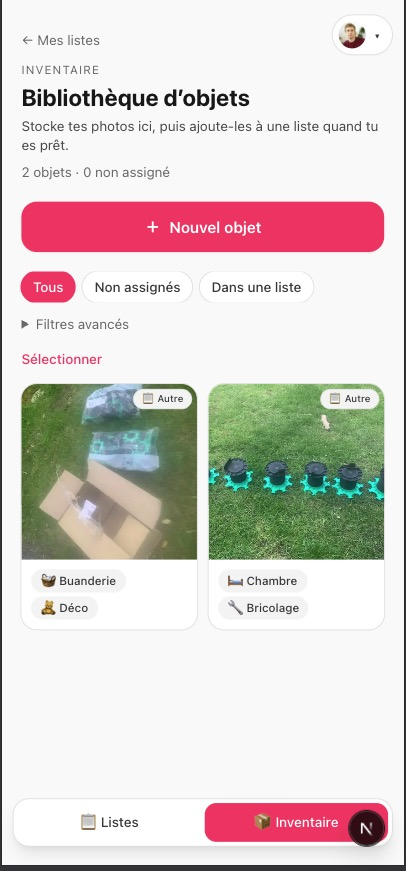
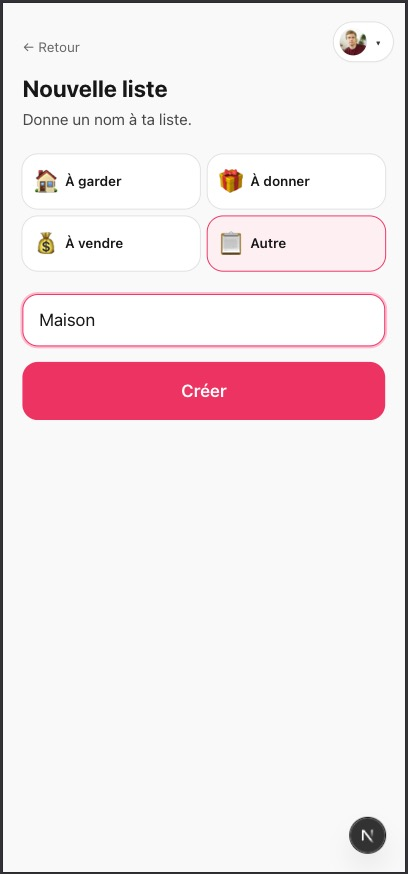
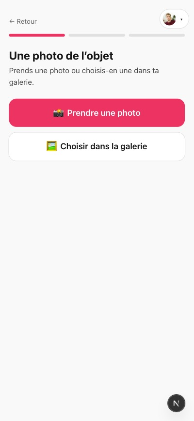
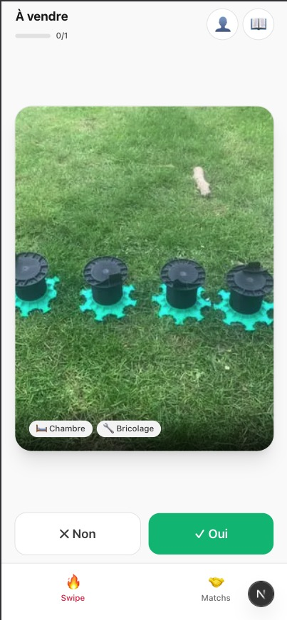

# Share Items

<p align="center">
  <a href="https://share-items.vercel.app/">
    
  </a>
</p>

<p align="center">
  <strong>Démo en ligne : <a href="https://share-items.vercel.app/">share-items.vercel.app</a></strong>
</p>

App **Next.js** mobile-first pour lister des objets, faire voter tes proches façon **Tinder**, et attribuer chaque chose à la bonne personne (débarras, dons, ventes).

- **Organisateur** : compte Google/Apple (Auth.js), listes par type, inventaire perso réutilisable, tags, partage natif (WhatsApp, Messenger…).
- **Votant** : prénom suffit ; connexion Google optionnelle pour plus de sécurité. Swipe, historique, matchs.

Specs : [MVP-v2.md](./MVP-v2.md) (actuel) · [MVP.md](./MVP.md) (v1 historique).

---

## Aperçu

<p align="center">
  
  
</p>
<p align="center">
  
  
</p>
<p align="center">
  
</p>

> Images haute résolution dans le dossier [`promo/`](./promo/) (`1.jpg` … `5.jpg`).

---

## Stack

| Couche | Techno |
|--------|--------|
| Framework | Next.js 15 (App Router) + TypeScript |
| UI | Tailwind CSS, Framer Motion (swipe + modales) |
| Base | Prisma + **PostgreSQL** |
| Auth organisateur | Auth.js v5 (NextAuth) — Google, Apple |
| Images | Sharp (512 px, JPEG ≤ 500 Ko) · Vercel Blob (prod) · `public/uploads/` (dev local) |

---

## Démarrer en local

### Prérequis

- Node.js 20+
- PostgreSQL (Docker, Neon, Supabase ou Postgres.app)

### Installation

```bash
git clone https://github.com/<ton-org>/share-items.git
cd share-items
npm install
cp .env.example .env
# Édite .env : DATABASE_URL, AUTH_SECRET, AUTH_GOOGLE_* (voir ci-dessous)
npx prisma migrate dev
npm run dev
```

L’app tourne sur **http://localhost:3000**.

En dev, sans `BLOB_READ_WRITE_TOKEN`, les photos sont enregistrées dans `public/uploads/` (dossier ignoré par git).

---

## Parcours

### Organisateur (connecté)

| Route | Rôle |
|-------|------|
| `/login` | Connexion Google / Apple |
| `/dashboard/lists` | **Listes** — accueil, créer une campagne (à garder / donner / vendre / autre) |
| `/dashboard/[listId]` | Détail liste : **Objets** · **Résultats** · **Partager** (lien + menu natif) |
| `/dashboard/inventory` | Bibliothèque d’objets (photos réutilisables entre listes) |
| `/dashboard/inventory/new` | Wizard **Nouvel objet** (caméra ou galerie) |

### Votant (lien public `/l/[slug]`)

| Écran | Rôle |
|-------|------|
| Gate | Prénom **ou** « Continuer avec Google » |
| Swipe | Oui / Non sur chaque objet |
| 📖 | Historique des votes (modifier / tout effacer) |
| 👤 | Compte : changer de prénom, Google + déconnexion, lien vers le dashboard |
| Matchs | Objets que l’organisateur t’a attribués |

### Landing

- [https://share-items.vercel.app/](https://share-items.vercel.app/) — présentation + liens dashboard / exemple

---

## Règles métier (résumé)

- **1 vote** par objet et par votant (modifiable).
- **1 match** par objet, posé par l’organisateur sur un votant qui a dit **Oui**.
- Déplacer ou retirer un objet d’une liste **supprime** votes et matchs sur cette liste.
- Inventaire : objet sans liste (`listId` null) jusqu’à assignation.

Détail : [MVP-v2.md](./MVP-v2.md) §13.

---

## Variables d’environnement

Copie [`.env.example`](./.env.example) vers `.env` — **ne commite jamais** `.env`.

| Variable | Obligatoire | Usage |
|----------|-------------|-------|
| `DATABASE_URL` | Oui | PostgreSQL (`postgresql://…`) |
| `AUTH_SECRET` | Oui | Secret session Auth.js (`openssl rand -base64 32`) |
| `AUTH_GOOGLE_ID` / `AUTH_GOOGLE_SECRET` | Recommandé | Login organisateur + option votant |
| `AUTH_APPLE_ID` / `AUTH_APPLE_SECRET` | Optionnel | Sign in with Apple |
| `BLOB_READ_WRITE_TOKEN` | Prod Vercel | Upload images (Blob) |
| `AUTH_URL` | Optionnel | URL publique si proxy / domaine custom |

Redirect OAuth : `{ORIGIN}/api/auth/callback/google` (et `/apple`).

---

## Déploiement Vercel

Guide détaillé : **[DEPLOY.md](./DEPLOY.md)**

1. Base **PostgreSQL** + variables ci-dessus sur le projet Vercel.
2. **Blob** connecté au projet (`BLOB_READ_WRITE_TOKEN`).
3. Import du repo — le build exécute `prisma migrate deploy` (`vercel.json` / `scripts/vercel-build.sh`).

---

## Scripts npm

| Commande | Action |
|----------|--------|
| `npm run dev` | Serveur de développement |
| `npm run build` | Prisma generate + migrate deploy + build Next |
| `npm start` | Sert le build production |
| `npm run db:migrate` | Migration Prisma en dev |
| `npm run db:studio` | Prisma Studio |

---

## Structure du projet

```
promo/                    # Captures d’écran pour README / présentation
src/
  app/
    api/
      auth/               # Auth.js + claim listes v1
      inventory/          # CRUD inventaire, assign, move
      tags/               # Tags perso organisateur
      lists/              # Listes + résultats + slug public
      votes/ matches/ upload/
    dashboard/            # Espace organisateur
    l/[slug]/             # Expérience votant (swipe)
    login/
  components/
    ItemWizard.tsx        # Photo (caméra / galerie) → pièce → type → tags
    IdentityGate.tsx      # Prénom + Google (votant)
    TagPicker.tsx
  lib/
    identity.tsx          # visitorId localStorage (votant)
    list-kinds.ts         # keep | donate | sell | custom
    auth.ts               # requireUser / requireVisitor
prisma/
  schema.prisma
  migrations/
MVP-v2.md                 # Spécification produit v2
```

---

## Licence

Projet open source — voir le dépôt pour la licence applicable.
